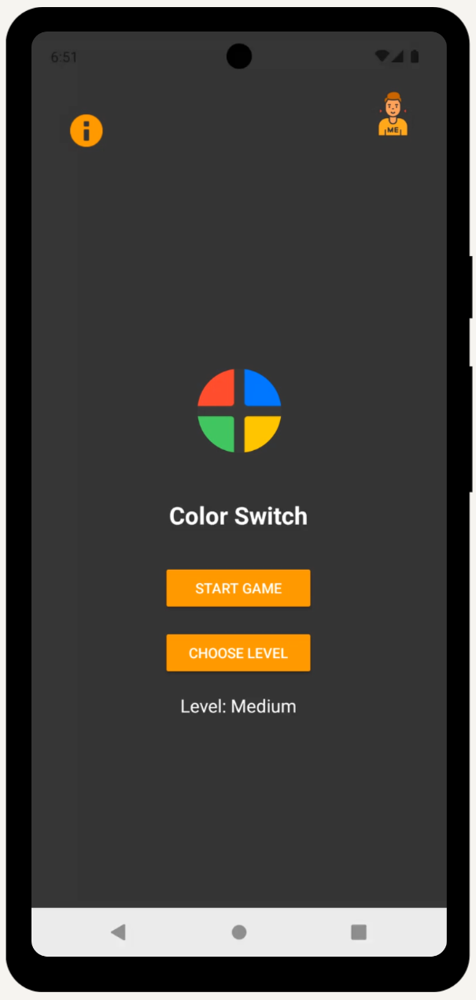
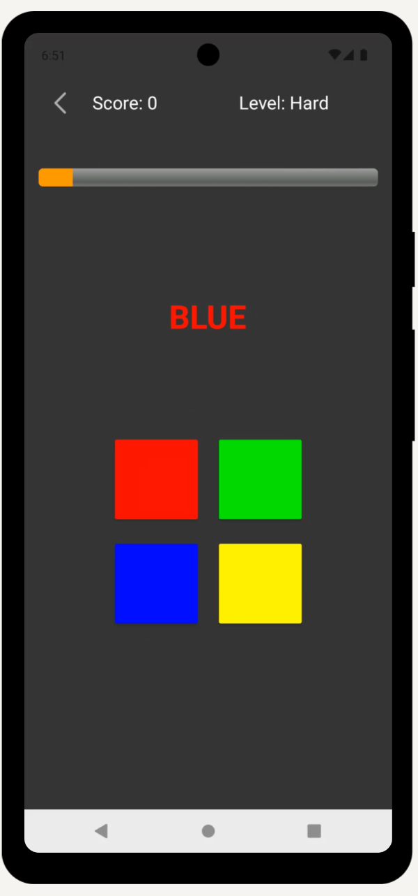
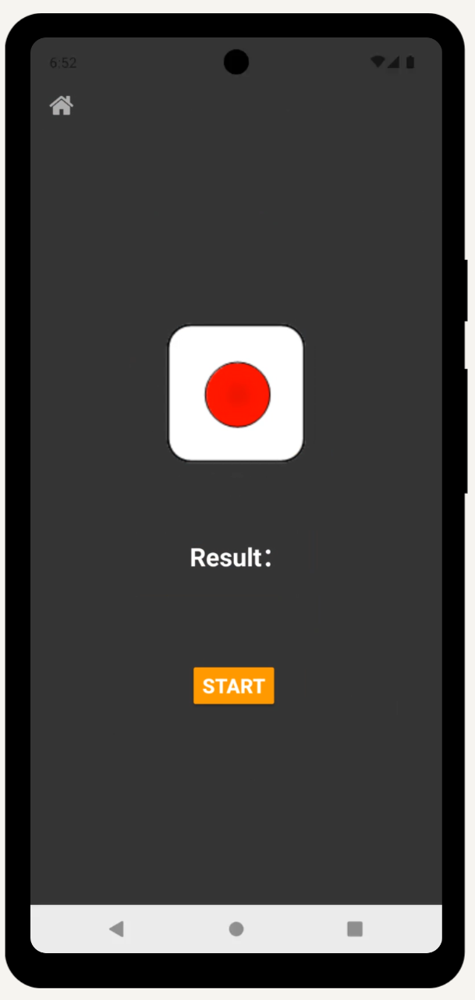
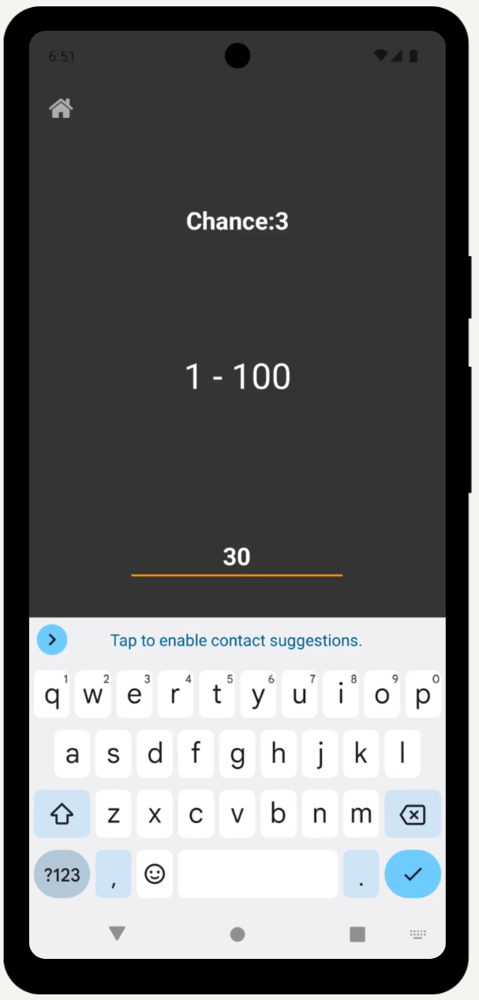
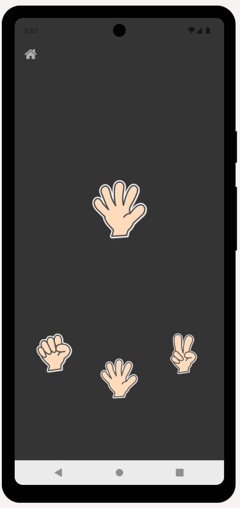

# 🎮 Color Switching Game 

The Color Switch Game is a fast-paced mobile game built with Android Studio for the Android system. Inspired by popular brain-training apps, this native experience tests your reaction time by pairing color names with mismatched hues. It's a fun, engaging way to train your cognitive decision-making and speed under pressure.

### 🚀 Try It Now 

---
## 📱Core Game Systems & Modes

### 🎨 Main Game: Color Switch
- 📊 Level System (Player can choose the leve of the game)

    | Level | Difficulty | Time Limit | 
    |-------|------------|------------|
    | 1 | Easy | 3.5 seconds | 
    | 2 | Medium | 2.5 seconds | 
    | 3 | Hard | 1.5 seconds | 
- The screen will show the color name (Red, blue, green, yellow) with different text color (🔴🔵🟢🟡), player need to match the target color name by tapping the correct button within the time limit
- Score points and restart the timer for each correct match
- A unique dual-game system where losing in the main game doesn't end your run - it sends you to a **challenge mini-game** for a second chance!
-  **Lose condition:** Tap wrong color or run out of time

### 🔄Random Mini-Games

When you lose in the Color Switching Game, you'll be sent to **one of three random mini-games**. Win to continue your run, lose and it's game over!

### 1. 🎲 Dice Game

Test your luck with a virtual dice roll!

**How to play:**
- Guess whether the dice will roll an **6** 

- **Win condition:** Guess correctly 
- **Lose condition:** Guess incorrectly 

### 2. 🔢 Guessing Game

Test your intuition with a number guessing challenge!

**How to play:**
- A random number is generated within a range (1-100)
- Enter your guess using the number pad
- Limited number of attempts (3 Time)

- **Win condition:** Guess the correct number within allowed attempts 
- **Lose condition:** Run out of attempts or guess incorrectly 

### 3. ✊📄✂️ Rock Paper Scissors

Face off against the computer in this classic hand game!

**How to play:**
- Choose **Rock** (✊), **Paper** (✋), or **Scissors** (✌️) by tapping the corresponding button
- Computer randomly picks its own hand

- **Win condition:** Your choice beats the computer's choice
- **Lose condition:** Computer's choice beats yours
- **Draw condition:** Play Rock Paper Scissors again until you win the game

### 🎯 Mini-Game Result

- ✅ **Win any mini-game** → Return to Color Switching Game (keep your score!)
- ❌ **Lose any mini-game** → Game over (score resets)

---

## 📸 Screenshots & Previews

  
| 🏠 Home Page | 🎨 Main Game | 🎲 Dice Game |
|:---:|:---:|:---:|
|  |  |  | 

 

| 🔢 Guessing Game | ✊📄✂️   Rock Paper Scissors | 
|:---:|:---:|
| |  

---

## 👤 Credits

Designed and Developed by **Hyman Cheung**
